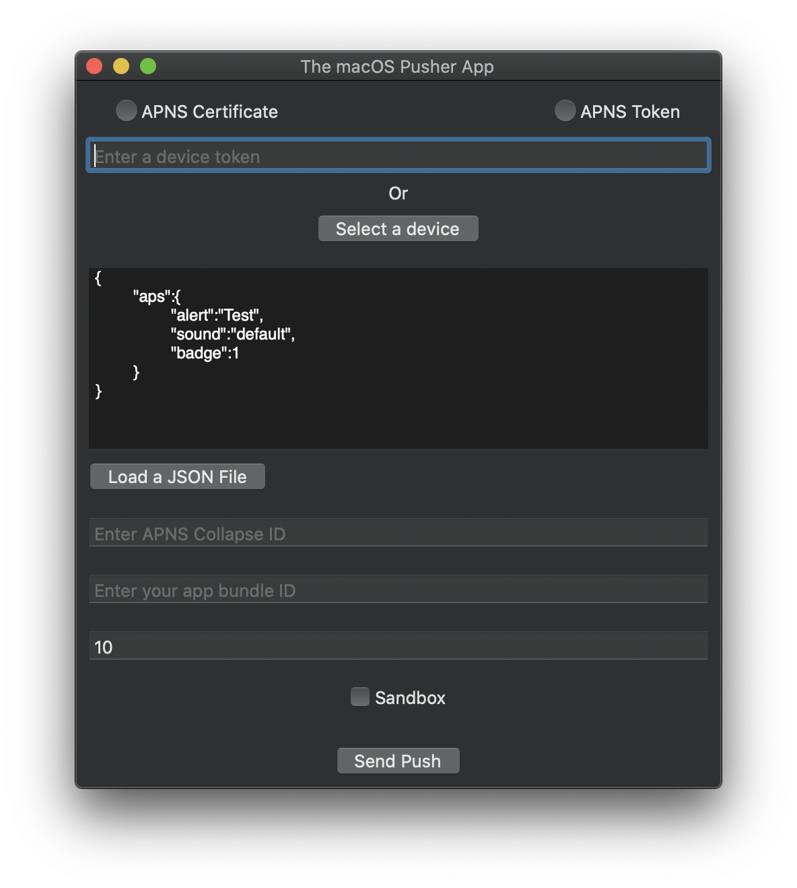

 
 
 
 

# The macOS Pusher App

The macOS Pusher App allows you to send push notifications through APNS (Apple Push Notification Service) and receive them on a device.

It can also get device tokens from any iPhone on the same wifi network.

**Notice**: This app was created to be used by the SSED SDK team internally. Anyone is free to use it but please be aware that it is unsupported.

## How to build/run from source

- 1) Run `pod install` from root folder
- 2) Open pusher.xcworkspace*
- 3) Build and run

## How to build with Fastlane

### Install fastlane
- 1) Using RubyGems `sudo gem install fastlane -NV`

- 2) Alternatively using Homebrew `brew cask install fastlane`

### Run fastlane
Run `fastlane macos ci`

## Make your iOS app discoverable by the macOS Pusher App

- 1) Add this class to your iOS app

```swift
import Foundation
import MultipeerConnectivity

public final class DeviceAdvertiser: NSObject {
    private var nearbyServiceAdvertiser: MCNearbyServiceAdvertiser?
    private let serviceType: String
    
    public init(serviceType: String) {
        self.serviceType = serviceType
        super.init()
    }

    public func setDeviceToken(_ deviceToken: String) {
        if let advertiser = nearbyServiceAdvertiser {
            advertiser.stopAdvertisingPeer()
        }

        let peerID = MCPeerID(displayName: UIDevice.current.name)
        
        nearbyServiceAdvertiser = MCNearbyServiceAdvertiser(
            peer: peerID,
            discoveryInfo: ["token": deviceToken, "appID": Bundle.main.bundleIdentifier ?? ""],
            serviceType: serviceType
        )
        
        nearbyServiceAdvertiser?.delegate = self
        nearbyServiceAdvertiser?.startAdvertisingPeer()
    }
}

extension DeviceAdvertiser: MCNearbyServiceAdvertiserDelegate {
    public func advertiser(_ advertiser: MCNearbyServiceAdvertiser, 
                            didReceiveInvitationFromPeer peerID: MCPeerID, 
                            withContext context: Data?, 
                            invitationHandler: @escaping (Bool, MCSession?) -> Void) {
        invitationHandler(false, MCSession())
    }
}
```
- 2) Instantiate `DeviceAdvertiser`

```swift
let deviceAdvertiser = DeviceAdvertiser(serviceType: "pusher")
```

- 3) Set the device token

```swift
func application(_ application: UIApplication, didRegisterForRemoteNotificationsWithDeviceToken deviceToken: Data) {
    deviceAdvertiser.setDeviceToken(deviceToken.hexadecimal)
}
```

- 4) Add this `Data` extension to convert deviceToken to `String`

```swift
import Foundation

extension Data {
    var hexadecimal: String {
        map { String(format: "%02x", $0) }.joined()
    }
}
```

- 5) Add the following to your targets info.plist (required for iOS 14 and above)

```xml
<key>NSBonjourServices</key>
<array>
	<string>_pusher._tcp</string>
	<string>_pusher._udp</string>
</array>
<key>NSLocalNetworkUsageDescription</key>
<string>To allow Pusher App to discover this device on the network.</string>
```

## UI Preview


